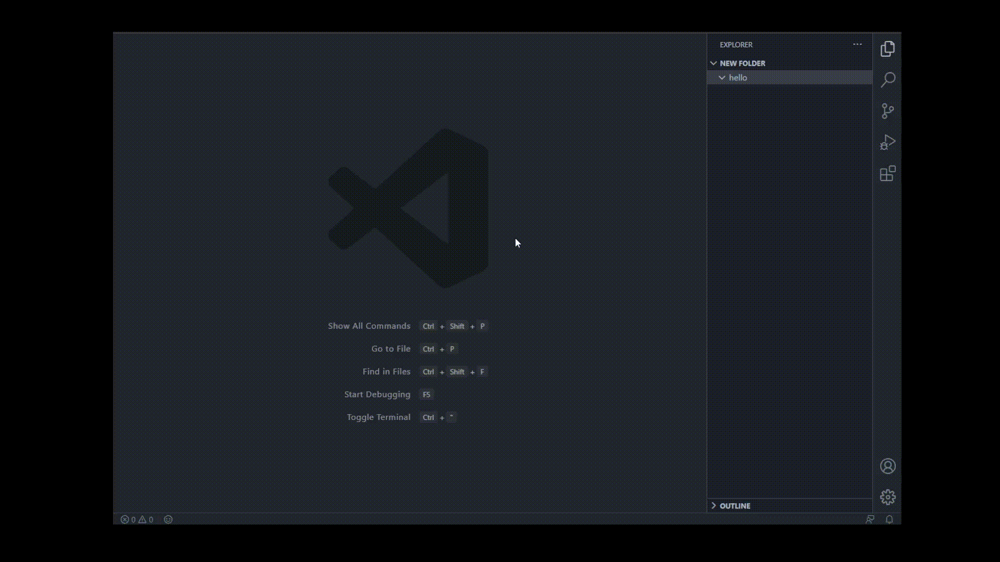
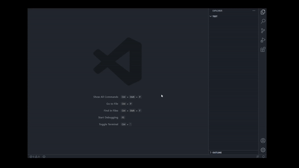

# FileSnippets 

FileSnippets is an extension which helps you create both main and import files.

## Features
---
### Create Files:
Easily create both main and import file for :
* CPP-H
* JS - CSS
* TS - CSS
* HTML - CSS

You can use command palette(Ctrl + Shift + P) to create files in project root folder or you can right click on a folder and select "Create Files" to create files in that folder.

---
### Create Project:
Create project with templates for :
* Cpp Makefile
* C Makefile
* Cs Console App
* Node.js Javascript

You dont need to do anything manual anymore. Open command palette, select Create Project , select the folder you want the project to be in, watch what happens.

## Known Issues

* Lack of templates.

## Release Notes

Users appreciate release notes as you update your extension.

### 0.0.1

Initial release of FileSnippets

### 0.0.2

Minor bugfix

### 1.0.0

Added support for creating projects.
