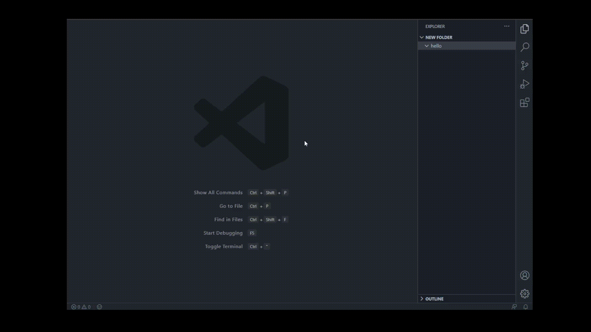

# FileSnippets 

FileSnippets is an extension which helps you create both main and import files.

## Features

Easily create both main and import file for :
* CPP-H
* JS - CSS
* TS - CSS
* HTML - CSS

You can use command palette(Ctrl + Shift + P) to create files in project root folder or you can right click on a folder and select "Create Files" to create files in that folder.

## Known Issues

* Lack of templates.

## Release Notes

Users appreciate release notes as you update your extension.

### 0.0.1

Initial release of FileSnippets

